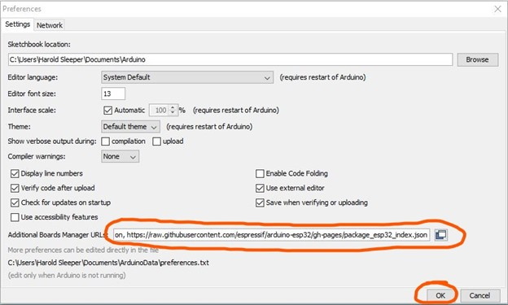
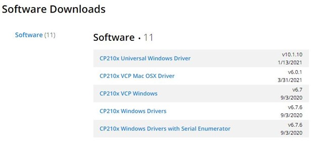

# Intelligent Dipstick
 
## Getting Started

### Download and Install Source Code
1. Download the project zip and extract it in a folder of your choice. 
2. Within the Intelligent-Dipstick-main/src folder are two subfolders: Capstone_Sensors and Capstone_Gateway. Move Capstone_Sensors and Capstone_Gateway folders to the computer's Arduino folder, typically C:\Users\YourUserName\Documents\Arduino
3. Follow the rest of the instructions outlined below

### Parts Needed
* 1 ESP32 Dev Kit C v4
* 1 Screw Terminal Block Breakout Board for ES32 Dev Kit C
* 1 ESP32 Dev Kit C v4
* 1 Screw Terminal Block Breakout Board for ES32 Dev Kit C
* 2 green LED lights
* 2 red LED lights
* 4 220-ohm resistors 
* 1 MAX 6675 + K-Type Thermocouple
* 1 MAX 4466 Microphone
* Varios jumper wires and breadboards as needed to make connections

Refer to the [Gateway Diagram](docs/Diagrams/Capstone_Gateway_Diagram.pdf) and [Sensor Diagram](docs/Diagrams/Capstone_Sensor_Diagram.pdf) as a guide to assemble the parts. 

### Setting Up Arduino IDE 1.8.19 for IDS Sensors and Gateway
Arduino’s IDE needs to be configured to compile its sketches appropriately for the ESP32.
** Disable any antivirus software temporarily for the next steps! **
1.	First in the Arduino IDE, go to the File menu and choose Preferences 
This should open a Preferences window. Within the Preferences window near the bottom, should be a text field labeled Additional Boards Manager URLs.
Copy the next two lines into the text field and press OK.

https://dl.espressif.com/dl/package_esp32_index.json, 
https://raw.githubusercontent.com/espressif/arduino-esp32/gh-pages/package_esp32_index.json

The two separate URLs should be separated by a comma as shown and as it appears in this text. 

2.	Next in the Arduino IDE, go to the Tools menu, choose Board, then go to Boards Manager…
This should open the Boards Manager window. 
Search for ESP32 and press install button for the ESP32 by Espressif Systems. 

3.	Go to [CP210x USB to UART Bridge VCP Drivers - Silicon Labs (silabs.com)](https://www.silabs.com/developers/usb-to-uart-bridge-vcp-drivers)
Near the top of the webpage should be a hyperlink labeled Downloads. Click it!
Choose CP210x Universal Windows Driver from the options. 

Extract the downloaded zip file into a location of your choosing and within that folder open CP210xVCPInstaller_x64.exe (this assumes you are using a 64-bit computer, otherwise choose the …_x86 option)
Follow the on-screen installation instructions

### Prepare Blues Wireless Notecard
*	Please follow the instructions found [here](https://dev.blues.io/quickstart/notecard-quickstart/notecarrier-af/#before-you-begin) on the Blues Wireless Developer site for directions on installing the Blues Wireless Notecard onto the Blues Wireless Notecarrier-AF. 
*	Once the Notecarrier is assembled use the instructions found [here](https://dev.blues.io/quickstart/notecard-quickstart/notecarrier-af/#set-up-notehub) to create a Notehub Project and obtain a ProductUID. 
*	Save the ProductUID for use later in this project. 

### Installing Arduino Libraries
*	Go to the Arduino IDE Tools menu, then choose Manage Libraries
*	Search for "Blues" in the input box and click the Install button next to the "Blues Wireless Notecard" result.
*	Search for MAX6675 and install the library by Yurri Salimov
*	Search for NimBLE and install the library by h2zero

### Uploading Arduino Programs onto the ESP32 Dev Kit C v1 and Adafruit Feather
To install Capstone_Sensors.ino onto the ESP32 Dev Kit C:
1.	Connect the Dev Kit C to a USB port via micro-USB connector
2.	Open Capstone_Sensors.ino in Arduino IDE
3.	Navigate to the Tools menu in Arduino IDE, then choose Port and select the appropriate serial port associated with the newly connected Dev Kit C
4.	Within the Tools menu, choose Board menu, select ESP Arduino, and from that menu choose “ESP32 Dev Module” 
5.	 Navigate to the Sketch menu in Arduino IDE and select the Upload option (alternatively press Ctrl+U). The program will compile and upload onto the ESP32 board. 

