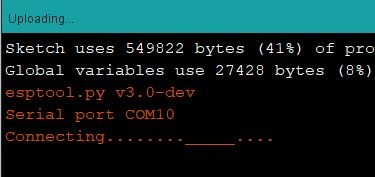
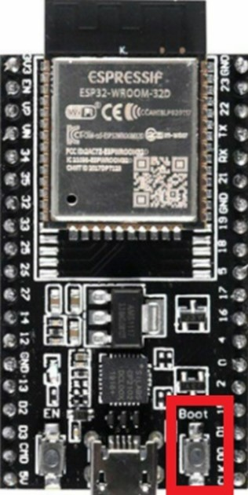
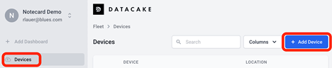
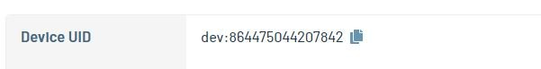
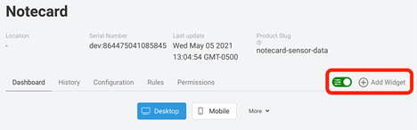

# Intelligent Dipstick

The Intelligent Dipstick is an IoT device powered by Espressif's ESP32 Dev Kit C v4, Adafruit's ESP32 Feather, and a Blues Wireless Notecard. This device is meant to be used as a dipstick for gearboxes within commercial mowers for the purpose of monitoring gearbox temperature and to listen for sounds which might indicate damage to the gearbox. 
 
## Table of Contents
* [Parts Needed](https://github.com/sleeperh/Intelligent-Dipstick#parts-needed)
* [Setting Up Arduino](https://github.com/sleeperh/Intelligent-Dipstick#setting-up-arduino-ide-1819-for-ids-sensors-and-gateway)
* [Prepare Blues Wireless Notecard](https://github.com/sleeperh/Intelligent-Dipstick#prepare-blues-wireless-notecard)
* [Installing Arduino Libraries](https://github.com/sleeperh/Intelligent-Dipstick#prepare-blues-wireless-notecard)
* [Download and Install Source Code](https://github.com/sleeperh/Intelligent-Dipstick#download-and-install-source-code)
* [Upload Arduino Programs](https://github.com/sleeperh/Intelligent-Dipstick#uploading-arduino-programs-onto-the-esp32-dev-kit-c-v1-and-adafruit-feather)
* [Routing from Notehub to Datacake](https://github.com/sleeperh/Intelligent-Dipstick#routing-from-notehub-to-datacake)
* [Create Datacake Widgets](https://github.com/sleeperh/Intelligent-Dipstick/blob/main/README.md#create-datacake-widgets)

## Parts Needed
* 1 Blues Wireless NoteCarrier-AF with Notecard
* 1 ESP32 Dev Kit C v4
* 1 Screw Terminal Block Breakout Board for ES32 Dev Kit C
* 2 green LED lights
* 2 red LED lights
* 4 220-ohm resistors 
* 1 MAX 6675 + K-Type Thermocouple
* 1 MAX 4466 Microphone
* Various jumper wires and breadboards as needed to make connections

Refer to the [Gateway Diagram](docs/Diagrams/Capstone_Gateway_Diagram.pdf) and [Sensor Diagram](docs/Diagrams/Capstone_Sensor_Diagram.pdf) as a guide to assemble the parts. 

## Setting Up Arduino IDE 1.8.19 for IDS Sensors and Gateway
Arduino’s IDE needs to be configured to compile its sketches appropriately for the ESP32.
** Disable any antivirus software temporarily for the next steps! **
1.	First in the Arduino IDE, go to the File menu and choose Preferences 
This should open a Preferences window. Within the Preferences window near the bottom, should be a text field labeled Additional Boards Manager URLs.
Copy the two URLs below into the text field and press OK. The two URLs should be separated by a comma as shown and as it appears in this text. 

https://dl.espressif.com/dl/package_esp32_index.json, 
https://raw.githubusercontent.com/espressif/arduino-esp32/gh-pages/package_esp32_index.json

2.	Next in the Arduino IDE, go to the Tools menu, choose Board, then go to Boards Manager…
This should open the Boards Manager window. 
Search for ESP32 and press install button for the ESP32 by Espressif Systems. 

3.	Go to [CP210x USB to UART Bridge VCP Drivers - Silicon Labs (silabs.com)](https://www.silabs.com/developers/usb-to-uart-bridge-vcp-drivers)
Near the top of the webpage should be a hyperlink labeled Downloads. Click it!
Choose CP210x Universal Windows Driver from the options. 

Extract the downloaded zip file into a location of your choosing and within that folder open CP210xVCPInstaller_x64.exe (this assumes you are using a 64-bit computer, otherwise choose the …_x86 option)
Follow the on-screen installation instructions

## Prepare Blues Wireless Notecard
1.	Please follow the instructions found [here](https://dev.blues.io/quickstart/notecard-quickstart/notecarrier-af/#before-you-begin) on the Blues Wireless Developer site for directions on installing the Blues Wireless Notecard onto the Blues Wireless Notecarrier-AF. 
2.	Once the Notecarrier is assembled use the instructions found [here](https://dev.blues.io/quickstart/notecard-quickstart/notecarrier-af/#set-up-notehub) to create a Notehub Project and obtain a ProductUID. 
    *	Save the ProductUID for use later in this project. 

## Installing Arduino Libraries
*	Go to the Arduino IDE Tools menu, then choose Manage Libraries
    *	Search for "Blues" in the input box and click the Install button next to the "Blues Wireless Notecard" result.
    *	Search for "MAX6675" and install the library by Yurri Salimov
    *	Search for "NimBLE" and install the library by h2zero
    *	Search for "FFT" and install the arduinoFFT library by Enrique Condes
## Download and Install Source Code
1. Download the project zip and extract it in a folder of your choice. 
2. Within the Intelligent-Dipstick-main/src folder are two subfolders: Capstone_Sensors and Capstone_Gateway. Move Capstone_Sensors and Capstone_Gateway folders to the computer's Arduino folder, typically C:\Users\YourUserName\Documents\Arduino

## Uploading Arduino Programs onto the ESP32 Dev Kit C v1 and Adafruit Feather
To install Capstone_Sensors.ino onto the ESP32 Dev Kit C:
1.	Connect the Dev Kit C to a USB port via micro-USB connector
2.	Open Capstone_Sensors.ino in Arduino IDE
3.	Navigate to the Tools menu in Arduino IDE, then choose Port and select the appropriate serial port associated with the newly connected Dev Kit C
4.	Within the Tools menu, choose Board menu, select ESP Arduino, and from that menu choose “ESP32 Dev Module” 
5.	Navigate to the Sketch menu in Arduino IDE and select the Upload option (alternatively press Ctrl+U). The program will compile and upload onto the ESP32 board. 
    * Depending on the manufacturer, the Dev Kit C might require the user to press and hold the Boot button on the ESP32 board while Arduino IDE tries to connect to it. Release boot button when uploading proceeds.  

      

## Routing from Notehub to Datacake
1. Create a [Datacake](https://app.datacake.de/signup) account
2. After creating an account, you should be redirected to your workspace. If you do not get redirected, go to [Datacake](https://datacake.co/)’s main site and click on the Dashboard button at the top right hand corner of the webpage. 
3. Sign into the dashboard using your newly created credentials 
4. Click on the Devices from the menu on the left of the dashboard, then click the blue button on the right hand of the dashboard called Add Device. 

5. Choose the API device type, then select New Product and provide a Product Name
6. In a separate window, go to sign into Blues Notehub and
    * choose the Project you created when setting up Notehub. 
    * Then, choose Devices from the menu on the left and copy the Device UID

7.	Back on the Datacake device creation screen, paste your Device UID in the Serial Number field and provide a name to label the device. 
8.	Choose the free plan, you can upgrade later
9.	Once you have created your Datacake device, you should be redirected to an overview of your Datacake devices. Click on the newly created device and open the device view. 
10.	Choose the Configuration tab to configure the device 
11.	Look for the Fields section and click on Add Fields. This will allow you to  create numerous database fields to hold data that comes from Notehub. Add one called Temp 1, with Identifier TEMP_1 type: Float; Time, with Identifier TIME type: Float; Error, with Identifier ERROR type: Boolean; boolSound, with Identifier BOOLSOUND type: Boolean; and, Sound, with Identifier SOUND type: Integer.
12.	Navigate back up the page to the HTTP Payload Decoder section. 
13.	Copy and paste the following code into the code editor, replacing any existing code: 
       
        function Decoder(request) 
        {
            var data = JSON.parse(request.body);
            var device = data.device;

            var decoded = {};
            decoded.temp1 = data.body.temp1;
            decoded.sound = data.body.numSound;
            decoded.boolSound = data.body.sound
            decoded.error = data.body.error;
            decoded.time = data.when;

            return [
                {
                    device: device,
                    field: "TEMP_1",
                    value:decoded.temp1
                },
                {
                    device: device,
                    field: "SOUND",
                    value:decoded.sound
                },
                {
                    device: device,
                    field: "BOOLSOUND",
                    value:decoded.boolSound
                },
                {
                    device: device,
                    field: "ERROR",
                    value:decoded.error
                },
                {
                    device: device,
                    field: "TIME",
                    value: decoded.time
                }
            ];
        }

14.	Navigate to the HTTP Endpoint URL and copy it.
15.	Back in Notehub, click on Routes in your Projects menu to the left and then click Create Route on the top right corner of the webpage. 
16.	Select the General HTTP/HTTPS Request/Response route type.
17.	Provide a name for the route and paste the HTTP Endpoint URL for the URL.
18.	In the Notefiles dropdown, choose Select Notefiles and choose sensors.qo
19.	Then, click Create Route to save the route.
20.	Back in Datacake, choose Devices from the menu on the right and select your device from the list in the center of the screen. 
21.	Go to the Dashboard tab and click the toggle button to enable editing for your dashboard.

## Create Datacake Widgets
### Create Temperature Chart Widget
1.	Click Add Widget.

2.	Choose Chart from the list and create a Title in the Basic tab. 
3.	Within the Data tab, click Add Field and choose Temp 1 from the Field drop down and then click the Save button.
4.	Click Add Widget again and choose Value. 
5.	Select Current Value in the Timeframe tab.
6.	Within the Basics tab, create a title for the widget such as Temperature Chart.
7.	Within the Data tab, select Temp 1 from the Field drop down and click Save.
### Create Current Temperature Widget
1. Click Add Widget.
2. Choose Value from the list and create a Title in the Basic tab. 
3. Within the Data tab, select Temp 1 in the Field drop down menu, enter F as a Unit.
4. In the Gauge tab, select circular as the Gauge Type. Enter 0, 70, 220, and 440 as Values and select an appropriate color for each. 
5. In the Timeframe tab, make sure Current Value is selected. 
6. Click Save.
### Create Sound Boolean Widget
1. Click Add Widget.
2. Choose Boolean from the list and create a Title in the Basics tab
3. In the Data tab, choose boolSound in the Field textbox
4. In the Appearance tab, enter Sound Detected in the Display On Text text box
5. Inside the Display Off Text text box, enter No Sound Detected
6. Toggle on the Widget color based on state toggle
7. Choose an appropriate color for the on and off states and click Save
### Create Sound History Widget
1. Click Add Widget.
2. Choose Chart from the list
3. In the Basic tab, Enter Sound History as a Title
4. In the Data tab, select Sound in the Field dropdown and select Bar Chart
5. In the Axes tab, toggle on Hide Axis 
6. Within the Timeframe tab, choose Custom
7. In the From field, type in 1 Hour Ago
8. In the Until field, enter Now
9. In the Resolution field, enter 1 and select minutes in the drop down menu
10. Click Save
### Create Error Widget
1. Choose Boolean from the list and create a Title in the Basics tab
2. In the Data tab, choose Error from the field drop down menu
3. In the Appearance tab, Enter Hardware Failure Detected as the Display On Text
4. Enter No Hardware Issues as the Display Off Text
5. Choose Red for the Display On Color
6. Choose Green for the Display Off Color
7. Click Save

Now the setup should be complete. Find a good power source and power the ESP Dev Kit C via its micro USB port. Power the Blues Wireless Notecard via the micro USB port directly on the Notecarrier-AF – not the port of the ESP32 Feather. 
